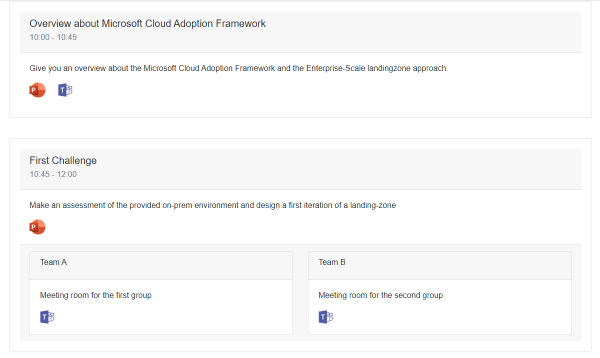
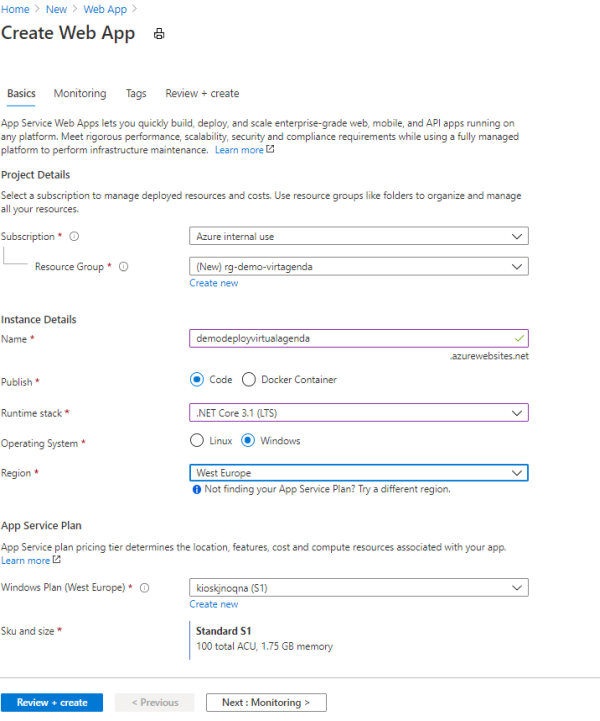
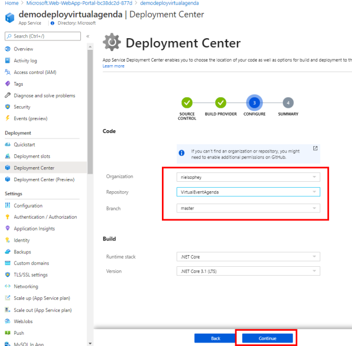

# Virtual Event Agenda

This project has a very simple background. As the COVID-19 pandemic changed the way I delivered workshops or trainings, I needed something to present the agenda of a training upfront to my attendees and I needed the opportunity to direct not so MS Teams familiar user directly to the session they need to attend. Especially if the training has hands on parts, which are delivered in smaller groups. Call it breakout session! 

So what we have done in the past, we divided the class into separate teams and send them in different rooms to work on their hands-on parts. In the virtual delivery the idea is, to have separate MS Teams Meeting for each Team in your class and maybe also have a main session for the whole class.

## Sample Agenda with Breakouts

Here you can see a typical agenda of a workshop I often delivered:


|Slot|Session|
|---|---|
|10:00 - 10:45|Overview about Microsoft Cloud Adoption Framework|
|10:45 - 12:00|First challenge - _hands on with breakout into teams_|
|12:00 - 13:00|Lunch break|
|13:00 - 13:45|Introduction to the critical design areas|
|14:00 - 16:30|Second challenge - _hands on with breakout into teams_|
|16:30 - 17:00|Wrap-up and closing|

This agenda is provided as a sample in this project - so that you can see how I used this tool in action. 

## How the Virtual Agenda project helps you

You can use this project to deploy a website, which will host your agenda as well as the links to the teams sessions of each agenda item. For sure, it could be one Microsoft Teams Meeting for all sessions in the agenda, but latest at the point where you divide the class into breakouts you need additional Microsoft Teams Meetings.

So if, the attendees in your workshop are not so used to Microsoft Teams, you than have the change to prove them the direct link to the meeting.



In addition to the option of providing the links to the Microsoft Teams Meetings, you can also provide the direct download link of the presentations shown in the session as long as the URLs are reachable for the visitors of the website.

## Use the Virtual Agenda and configure your agenda

### Get started and fork the repository

The first step would be to fork this repository in your own repository and start to use the source code from there. If you need more information about forking a repository please visit [this github page](https://guides.github.com/activities/forking/). As soon as you have your own fork of our project you can start to [clone the repository](https://docs.github.com/en/enterprise/2.13/user/articles/cloning-a-repository) to your local machine.

In my case I often use [Visual Studio Code](https://code.visualstudio.com/) for this. Also you will need to have at least the following prerequisites installed on your machine to run this project local:

- [.net core sdk](https://dotnet.microsoft.com/download/dotnet-core) - the project used version 3.1.401 at the time of publishing.
- Visual Studio Code, Visual Studio or any other editor of your choice

If you had no experience until now with Blazor - you can go thru this short ["getting stated"](https://dotnet.microsoft.com/learn/aspnet/blazor-tutorial/install) in the dotnet website. This was also my starting point while building this project. An other great source is the ["ASP.NET Core 101" video series on channel9](https://channel9.msdn.com/Series/ASPNET-Core-101) from Lealie Richardson and Scott Hanselmann.

Now that you have your clone of source code on your machine you can navigate to the __{your-project-path}\wwwroot\data__ folder in the basic path of your project. In this folder there is a sample __agenda.json__ file, which represents the given sample agenda. 


If you open the file you will see a structure like this:

```json
 {
    "Id": 2,
    "Title": "First Challenge",
    "OrderId": 2,
    "Description": "Make an assessment of the provided on-prem environment and design a first iteration of a landing-zone",
    "StartTime": "10:45",
    "EndTime": "12:00",
    "TeamsUrl": null,
    "PresentationUrl": "https://www.microsoft.com",
    "BreakOutSessions": [
      {
        "Title": "Team A",
        "Description": "Meeting room for the first group",
        "TeamsUrl": "https://www.microsoft.com"
      },
      {
        "Title": "Team B",
        "Description": "Meeting room for the second group",
        "TeamsUrl": "https://www.microsoft.com"
      }
    ]
  },
```

This is a JSON-Representation of the Session "First Challenge", which is divided in two breakouts "Team A" and "Team B". So this file is the persistent-layer in this project. So if you change this file, you change the shown agenda on the website. So it would be a good practice to have multiple versions of the agenda.json for the different workshops you normally provide.

### The potential changes you have to make to build your Virtual Agenda

If you want to use the Virtual Agenda in your context, it is a good practice to change the appearance of the website to meet more your corporate design guidelines. The whole VirtualAgenda Project is based on the sample Blazor Website. So we have bootstrap behind the scenes. So feel free to update and change all css-files in the repository. Best starting point is the site.css File in the wwwroot\css folder. 

If you want to change the text on the website, feel free to change it in the .razor Files under the \pages folder.

## How to deploy the Virtual Agenda website on Azure

There are multiple ways of deployment. To leverage the azure portal do the following steps:

### Fork this repository into your GitHub account

   

### Create a new WebApp to host your Website

   The runtime stack must be set to **.net core 3.1** and the operating system should be **windows**. In my case I used the S1 sizing for the WebApp.

   

### In the Deployment Center create the connection to your Github repository

   Connect the Repo and also define where the deployment pipeline should be hosted - you can use GitHub here in both areas:

#### The Source Control

   In this screenshot the connection to GitHub is already been configured. In case it is the first time using the deployment center - the GitHub credentials must be provided

   

#### Configure the Build Provider

  

#### Provide the needed configuration

  

### Let Azure do the magic ;-)

   Every time new code is checked into the configured branch, in this case the master branch, the GitHub Action will deploy your VirtualAgenda into the Webapp.

## Some tips

>### Buidl Agenda - Navigation
>If you have deployed your VirtualAgenda to Azure - you can add an application setting in the configuration __UseAdmin__ and set the value to __false__! The VirtualAgenda will then hide the build agenda site. You will still be able to directly call the build agenda site by using the direct path _nameofyourwebsite_.azurewebsites.net/BuildAgenda.


**Sample screenshot for the application setting:**

